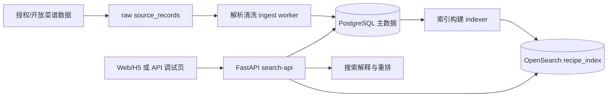

# Fridge2Recipe 搜索引擎 2 周落地计划

## 1. 压缩后的目标

原计划的 3-4 周版本可以覆盖数据治理、搜索、前端、媒体、埋点、收藏、营养和上线治理。压缩到 2 周后，目标必须收敛为一个可演示、可评测、可继续扩展的反向食材搜索引擎 MVP。

2 周内必须交付：

1. 用户输入现有食材后，系统能完成食材解析、同义词归一和基础单位识别。
2. 系统能按“现有食材命中数、缺少食材数、烹饪时间、质量分”检索并排序菜谱。
3. 支持烹饪时间、难度、菜系、排除食材 4 类核心筛选。
4. 搜索结果能解释：命中了哪些食材、还缺哪些食材、为什么排在前面。
5. 具备可重复运行的数据导入、清洗、索引构建和重建流程。
6. 具备一组黄金查询集，用于验证搜索效果不靠主观感觉。

2 周内主动砍掉：

1. 原生移动端。
2. 图像识别冰箱食材。
3. LLM 自动生成菜谱步骤。
4. 完整营养计算和膳食优化。
5. 复杂视频转码链路。
6. 完整个性化推荐系统。
7. 完整版权工单后台，只保留 `rights_status`、`source_url`、`takedown_status` 字段和屏蔽逻辑。

推荐技术栈保留为：PostgreSQL + OpenSearch + FastAPI + Docker Compose。Redis 在 2 周版本中设为可选，只有搜索延迟或热点查询明显需要时再接入。

## 2. 最小可落地架构



落地原则：

1. PostgreSQL 是事实源，保存规范化后的菜谱、食材、别名、步骤和来源信息。
2. OpenSearch 是检索副本，只保存搜索和列表展示需要的字段。
3. FastAPI 只做三件事：解析输入、查询 OpenSearch、回源 PostgreSQL 补详情。
4. 食材检索不依赖中文全文分词，主召回字段用结构化 `ingredients.canonical_id` 和 `ingredients.canonical_name`。
5. 标题、标签、步骤摘要只做辅助召回，不作为第一版排序核心。

## 3. 数据模型落地

2 周版本只需要以下 7 张核心表。

```sql
create table ingredients (
    id bigserial primary key,
    canonical_name varchar(80) not null unique,
    category varchar(80),
    parent_id bigint references ingredients(id),
    status varchar(20) not null default 'active',
    created_at timestamptz not null default now()
);

create table ingredient_aliases (
    id bigserial primary key,
    ingredient_id bigint not null references ingredients(id),
    alias varchar(80) not null,
    source varchar(40) not null default 'manual',
    confidence numeric(4,3) not null default 1.0,
    unique(alias)
);

create table recipes (
    id bigserial primary key,
    source_name varchar(80) not null,
    source_recipe_id varchar(120),
    source_url text,
    title varchar(200) not null,
    cuisine varchar(80),
    difficulty smallint,
    total_minutes int,
    servings numeric(8,2),
    quality_score numeric(6,3) not null default 0,
    rights_status varchar(20) not null default 'clear',
    takedown_status varchar(20) not null default 'active',
    content_hash char(64),
    created_at timestamptz not null default now(),
    updated_at timestamptz not null default now()
);

create table recipe_ingredients (
    id bigserial primary key,
    recipe_id bigint not null references recipes(id),
    ingredient_id bigint references ingredients(id),
    raw_text varchar(200) not null,
    canonical_name varchar(80),
    quantity numeric(10,3),
    unit varchar(30),
    required boolean not null default true,
    position int not null default 0
);

create table recipe_steps (
    id bigserial primary key,
    recipe_id bigint not null references recipes(id),
    step_no int not null,
    text text not null,
    image_url text
);

create table source_records (
    id bigserial primary key,
    source_name varchar(80) not null,
    source_id varchar(120),
    source_url text,
    raw_payload jsonb not null,
    payload_hash char(64),
    imported_at timestamptz not null default now()
);

create table search_events (
    id bigserial primary key,
    query_text text,
    parsed_ingredients jsonb,
    filters jsonb,
    result_count int,
    latency_ms int,
    created_at timestamptz not null default now()
);
```

索引建议：

```sql
create index idx_recipe_ingredients_recipe on recipe_ingredients(recipe_id);
create index idx_recipe_ingredients_ingredient on recipe_ingredients(ingredient_id);
create index idx_recipes_filter on recipes(rights_status, takedown_status, cuisine, difficulty, total_minutes);
create index idx_aliases_alias on ingredient_aliases(alias);
```

如果不想第一周就引入 OpenSearch，PostgreSQL 可作为短期兜底：`recipe_ingredients.ingredient_id` 做集合匹配，`recipes` 做筛选排序。但正式 MVP 仍建议在第 4 天前接通 OpenSearch。

## 4. 食材解析与归一实现方法

输入示例：

```json
{
  "items": ["西红柿2个", "鸡蛋 3枚", "小葱少许", "不想吃香菜"]
}
```

解析流程：

1. 文本规范化：去空格、全半角转换、繁简转换、统一标点。
2. 分隔切块：按逗号、顿号、空格、换行、`+`、`、` 拆成候选食材。
3. 排除意图识别：命中“不吃、不要、排除、过敏、不想吃”时进入 `excluded_ingredients`。
4. 数量单位提取：用正则识别 `2个`、`300g`、`1勺`、`半斤`、`少许`。
5. 别名精确匹配：先查 `ingredient_aliases.alias`，如“西红柿”映射到“番茄”。
6. 模糊候选兜底：未命中时用 `pg_trgm` 或 OpenSearch ngram 找 top 5 候选，置信度低于阈值则返回待确认。
7. 上下位处理：如“辣椒”是上位词，不强行合并到“小米辣/青椒/杭椒”，只作为 parent 查询扩展。

返回示例：

```json
{
  "ingredients": [
    {"raw": "西红柿2个", "canonical": "番茄", "quantity": 2, "unit": "个", "confidence": 1.0},
    {"raw": "鸡蛋 3枚", "canonical": "鸡蛋", "quantity": 3, "unit": "枚", "confidence": 1.0},
    {"raw": "小葱少许", "canonical": "小葱", "quantity": null, "unit": "少许", "confidence": 0.95}
  ],
  "excluded_ingredients": ["香菜"],
  "need_confirmation": []
}
```

第一版食材词典不要追求全量。建议先人工整理 500-1000 个高频食材和 1500-3000 个别名，覆盖家常菜主场景：蛋奶、肉禽、水产、蔬菜、菌菇、豆制品、主食、调味品。

## 5. OpenSearch 索引设计

索引名建议带版本号，便于重建和切换：

```text
recipes_v1
```

文档结构：

```json
{
  "recipe_id": 1001,
  "title": "番茄炒蛋",
  "cuisine": "家常菜",
  "difficulty": 1,
  "total_minutes": 15,
  "quality_score": 0.92,
  "popularity_score": 0.31,
  "rights_status": "clear",
  "takedown_status": "active",
  "tags": ["快手菜", "下饭菜"],
  "ingredients": [
    {"ingredient_id": 1, "canonical_name": "番茄", "required": true, "position": 1},
    {"ingredient_id": 2, "canonical_name": "鸡蛋", "required": true, "position": 2},
    {"ingredient_id": 3, "canonical_name": "小葱", "required": false, "position": 3}
  ],
  "step_summary": "番茄切块，鸡蛋打散，先炒蛋再炒番茄..."
}
```

核心 mapping：

```json
{
  "mappings": {
    "properties": {
      "recipe_id": {"type": "keyword"},
      "title": {"type": "text"},
      "cuisine": {"type": "keyword"},
      "difficulty": {"type": "byte"},
      "total_minutes": {"type": "integer"},
      "quality_score": {"type": "float"},
      "popularity_score": {"type": "float"},
      "rights_status": {"type": "keyword"},
      "takedown_status": {"type": "keyword"},
      "tags": {"type": "keyword"},
      "ingredients": {
        "type": "nested",
        "properties": {
          "ingredient_id": {"type": "keyword"},
          "canonical_name": {"type": "keyword"},
          "required": {"type": "boolean"},
          "position": {"type": "integer"}
        }
      },
      "step_summary": {"type": "text"}
    }
  }
}
```

查询策略：

1. `filter`：`rights_status=clear`、`takedown_status=active`、时间/难度/菜系过滤。
2. `should`：nested ingredients 命中用户已有食材。
3. `must_not`：nested ingredients 命中用户排除食材。
4. `size`：先召回 200-300 条候选，再由 FastAPI 重排。

## 6. 排序公式

第一版不要依赖黑盒模型，直接用可解释公式。

核心特征：

1. `matched_required_count`：用户已有食材命中菜谱必需食材数。
2. `missing_required_count`：菜谱必需食材中用户缺少的数量。
3. `coverage_user`：用户输入食材中被菜谱使用的比例。
4. `coverage_recipe`：菜谱必需食材中被用户已有食材覆盖的比例。
5. `time_fit`：菜谱总时长是否满足用户筛选或默认偏好。
6. `quality_score`：数据完整度、步骤完整度、来源可信度。
7. `lexical_score`：OpenSearch 原始相关性。

建议公式：

```python
final_score = (
    0.35 * coverage_recipe
    + 0.20 * coverage_user
    + 0.15 * quality_score
    + 0.10 * time_fit
    + 0.10 * normalized_lexical_score
    + 0.05 * popularity_score
    - 0.20 * min(missing_required_count, 5) / 5
    - 0.10 * excluded_hit
)
```

结果分层展示比单纯排序更好：

1. `马上能做`：缺少必需食材数为 0。
2. `再买 1 样`：缺少必需食材数为 1。
3. `还差几样`：缺少必需食材数为 2-3。
4. `灵感参考`：命中少但标题/标签相关。

前端解释文案：

```text
命中：番茄、鸡蛋、小葱
缺少：盐、生抽
推荐原因：已有食材覆盖 75%，总时长 15 分钟，难度较低
```

## 7. API 落地清单

2 周版本只做这些接口。

| Method | Path | 用途 | 是否必须 |
|---|---|---|---|
| POST | `/api/v1/ingredients/parse` | 输入食材解析与归一 | 必须 |
| POST | `/api/v1/search/by-ingredients` | 反向食材搜菜 | 必须 |
| GET | `/api/v1/recipes/{recipe_id}` | 菜谱详情回源 | 必须 |
| GET | `/api/v1/search/facets` | 当前条件下的筛选项统计 | 必须 |
| POST | `/api/v1/admin/import` | 导入菜谱数据 | 必须，可加简单 token |
| POST | `/api/v1/admin/reindex` | 重建 OpenSearch 索引 | 必须，可加简单 token |
| POST | `/api/v1/events/search` | 搜索埋点 | 可选 |

搜索请求示例：

```json
{
  "items": ["番茄", "鸡蛋", "小葱"],
  "excluded_items": ["香菜"],
  "filters": {
    "max_minutes": 30,
    "difficulty_lte": 2,
    "cuisine": ["家常菜"]
  },
  "page": 1,
  "page_size": 20
}
```

搜索响应示例：

```json
{
  "parsed": {
    "ingredients": ["番茄", "鸡蛋", "小葱"],
    "excluded_ingredients": ["香菜"]
  },
  "total": 128,
  "items": [
    {
      "recipe_id": 1001,
      "title": "番茄炒蛋",
      "total_minutes": 15,
      "difficulty": 1,
      "matched": ["番茄", "鸡蛋", "小葱"],
      "missing": ["盐"],
      "bucket": "再买 1 样",
      "score": 0.873,
      "reason": "命中 3 个已有食材，缺少 1 个基础调味，总时长 15 分钟"
    }
  ],
  "facets": {
    "cuisine": [{"name": "家常菜", "count": 86}],
    "difficulty": [{"value": 1, "count": 52}],
    "time_ranges": [{"label": "30 分钟内", "count": 91}]
  }
}
```

## 8. 两周排期

按 2 人、10 个工作日估算，总工时约 120-140 小时。周末只作为缓冲，不把核心交付压到周末。

| 日期 | 成员 A：数据/后端/搜索 | 成员 B：前端/测试/交付 | 当日验收 |
|---|---|---|---|
| D1 | 确认 MVP 边界；建 Docker Compose；建 PostgreSQL schema | 建 API 调试页或简版 Web 壳；确认结果页字段 | 本地能启动 API、DB、OpenSearch |
| D2 | 建 `ingredients` 和 alias 种子；完成 CSV/JSON 菜谱导入 raw layer | 做搜索页输入框、筛选区静态结构 | 能导入第一批 100-500 条菜谱样例 |
| D3 | 实现食材解析、单位提取、同义词归一 | 接入 `/ingredients/parse`，展示解析结果和待确认项 | “西红柿2个 鸡蛋3枚”能归一 |
| D4 | 建 OpenSearch mapping；写 indexer；完成全量重建 | 做结果列表组件、命中/缺失展示 | PostgreSQL 菜谱能进入 `recipes_v1` |
| D5 | 实现 `/search/by-ingredients` 基础召回 | 接入搜索 API，完成列表渲染和分页 | 输入食材能返回候选菜谱 |
| D6 | 实现重排公式、分层 bucket、排除食材、时间/难度/菜系过滤 | 筛选交互联动结果；加入推荐原因文案 | 搜索结果有排序解释和筛选 |
| D7 | 实现详情回源 API；补步骤、食材明细 | 做菜谱详情页或详情抽屉 | 从结果页能打开详情 |
| D8 | 加导入去重、rights/takedown 屏蔽、reindex alias 切换 | 做空结果、错误态、加载态；补基础埋点 | 下线内容不会出现在搜索结果 |
| D9 | 建 80-120 条黄金查询集；写单元/集成测试；做延迟压测 | 写 Playwright 主流程测试；修 UI 问题 | Recall@20、零结果率、P95 有基线 |
| D10 | 修排序和解析问题；整理部署脚本和 README | 准备演示数据、验收清单、已知问题列表 | 可演示、可重建、可评测 |

## 9. 两人分工

成员 A：数据、后端、搜索。

1. PostgreSQL schema 和迁移。
2. 菜谱导入器、raw 快照、去重。
3. 食材词典、alias、解析归一。
4. OpenSearch mapping、indexer、reindex。
5. 搜索 API、排序公式、性能压测。

成员 B：前端、体验、测试、交付。

1. 搜索页、筛选、结果列表。
2. 命中/缺失解释展示。
3. 菜谱详情页。
4. 空状态、错误态、加载态。
5. E2E 测试、演示脚本、README、部署检查。

共同决策只保留 3 件事：

1. 高频食材词典怎么合并。
2. 排序权重怎么调。
3. 哪些数据源可以进入演示库。

## 10. 黄金查询集与验收标准

黄金查询集至少覆盖 80-120 条，建议按下面分组：

1. 家常高频：番茄鸡蛋、土豆牛肉、青椒肉丝。
2. 同义词：西红柿/番茄，土豆/马铃薯，洋白菜/卷心菜。
3. 模糊输入：鸡旦、蕃茄、葱花少许。
4. 缺料场景：只有鸡蛋和米饭，还能做什么。
5. 排除场景：不要香菜、不吃辣、不要猪肉。
6. 时间场景：20 分钟内、快手菜、晚饭。
7. 筛选场景：家常菜、低难度、30 分钟内。
8. 零结果场景：很少见的食材组合，需要给相近灵感。

2 周验收标准：

1. 至少导入 5000 条可用菜谱；若授权数据不足，允许用 500-1000 条高质量样例完成演示，但导入器必须可扩展。
2. 高频食材 canonical 词典不少于 500 个，alias 不少于 1500 条。
3. 黄金查询集 Recall@20 不低于 0.75，Top 5 至少 1 条明显可用结果的比例不低于 80%。
4. 搜索接口在 1-5 万菜谱规模下 P95 小于 300 ms，不含图片加载。
5. 支持全量重建索引，并能通过 alias 切换到新索引。
6. `rights_status != clear` 或 `takedown_status != active` 的菜谱不会出现在结果中。
7. 结果必须展示命中食材、缺少食材和推荐原因。

## 11. 风险与降级方案

| 风险 | 影响 | 降级方案 |
|---|---|---|
| 授权菜谱数据不足 | 搜索效果无法真实验证 | 先用小规模样例库和导入接口演示，不做来源不明的大规模抓取 |
| OpenSearch 接入耗时 | 影响搜索 API | 临时用 PostgreSQL 集合匹配兜底，D6 前再切 OpenSearch |
| 中文分词效果不稳定 | 标题/步骤搜索不准 | 第一版以结构化食材召回为主，全文只辅助 |
| 食材别名质量差 | 命中率不稳定 | 每天固定 30 分钟根据黄金查询集补 alias |
| 排序解释不可信 | 用户不知道为什么推荐 | 所有结果都从 matched/missing/time/quality 生成解释，不展示抽象相关度 |
| 前端时间不够 | 演示体验受损 | 保留单页搜索和详情抽屉，砍收藏、复杂动画、个人中心 |

## 12. 2 周后的下一步

第一版验证通过后，下一阶段优先级：

1. 向量检索只做零结果回退，不替代结构化食材主召回。
2. 个性化只做轻量重排，不做独立推荐召回。
3. 扩充食材词典和 alias，优先修黄金查询集暴露的问题。
4. 加入营养字段，但只对明确用量的菜谱计算。
5. 增加版权下线工单和数据源审核后台。
6. 再考虑拍照识别冰箱食材、LLM 改写步骤、原生移动端。

